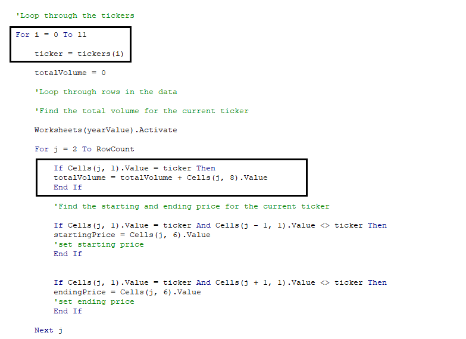

# VBA of Wall Street

## Overview of Project

### Purpose
The purpose of this analysis is to show my findings of the All Stocks Analysis and explain whether refactoring the code to loop through all the data one time successfully made the VBA script run faster.
## Analysis Results

### All Stocks Performance Analysis

The purpose of this code is to analyze an entire dataset of stocks prices and volumes at the click of a button. This code also provides the ability to specify the year for the analysis. Currently, Steve's parents are putting all their money in the DQ stock. With this code, Steve and parents would be able to compare DQ to other alternative energy stocks in 2017 and 2018 at the press of a button and get some new investment ideas to expand their portfolio.

When clicking the "All Stocks Analysis" button, the code will run automatically by looping through the dataset once and calculating the total volume and year-end return for each ticker. In addition to providing these numbers, the code will automatically format the results so that it is easier for the reader to compare the performance of the stocks. The results of the All Stocks Analysis for the years 2017 and 2018 are illustrated in the tables below.

As shown in the image above, DQ had the strongest stock return performance among the set of stocks provided by Steve. However, the 2017 performance cannot be used as a proper reference especially when we look at the 2018 All Stocks performanace shown below.

According to the graph, the same set of stocks experienced a decline of approximately 76% of the average retuns of the stocks in 2018. Moreover, DQ experienced the greatest decline in return in 2018, thus, showing the high volatility of this stock. On the other hand, there were two stocks that stuck out to me because of their consistent positive returns across 2017 and 2018: ENPH and RUN. Also, when comparing ENPH and RUN to the average return of each stock in 2017-2018, ENPH and RUN have a higher average return than DQ as shown in the graph below. Above all, ENPH and RUN demonstrated resiliency in maintaining high positive returns despite the overall decline in returns in 2018. Therefore, my suggestion to Steve's parents would be to purchase at least ENPH and SEDG to include in their alternative energy stocks portfolio because of their stable average higher return and because it will enable them to diversify their portfolio with stocks from companies that provide different solar energy products.

### Refactoring of the Code Analysis
My friend Steve appreciates my help with creating this code that analyzes many stocks at the same time, but Steve also wanted my help with making the code more flexible and efficient to analyze a wider set of stocks.  

In this analysis, I implemented a refactoring of the code to test whether refactoring could make the VBA script run faster. I created an index and created three arrays, tickerVolumes, tickerStartingPrices, and tickerEndingPrices, in addition to the tickers array that was also included in the code of the module. As the image below shows, the index was used as a reference across the different arrays used in the loop so that when the loop was running though the data, it would locate the specific ticker to use when collecting data. As a result, the loop would go through the data one time and collect all of the information without having to go through the entire set of rows multiple times trying to locate all the tickers. 

In the original code from the module, there was no index used and the three steps of identifying tickers, calculating tickerVolumes and setting the starting and ending prices were packed into one nested For Loop as shown in the image below. As shown, every time a new ticker is selected, the code will run through all the rows searching for this specific ticker and its corresponding data. As a result, the loop would be going through the same set of data **12 times** which causes a delay in execution. 

When running the original code without refactoring, the All Stocks Analysis takes about 0.98 and 0.95 seconds to run for the years 2017 and 2018 respectively.

Comparatively, after implementing refactoring to the original code, the All Stocks Analysis takes about 0.17 secs to run.

By using the tickerIndex to specify which ticker to look for, it helped reduced the runtime of the code by approximately an average of 0.79 secs or 82% for a database that contains 3013 rows of entries and which would make an even greater difference for a bigger database.

## Summary of Pros and Cons

## Challenges and Difficulties Encountered

One challenge encountered was to make the code running times comparable since the first time you run a macro, the elapsed time may be longer than subsequent runs because computer resources need to be allocated to run a macro. Therefore, it is important to ensure that the computer resources have been allocated by running the macros several times and compare the elapsed times to look for consistencies. Once the difference between the elapsed times for the same macro is minimal, then it is safe to compare it to the elapsed times of other macro runs. For instance, when conducting 10 consequent runs of the refactored code for 2017, the line graph below shows the elapsed time results for these runs with one repeated output highlighted in light blue. The biggest difference between the elapsed times lies between the first and second run. Therefore, it is important to not use the first run of the macro for elapsed times comparison purposes since the computer resources have not been allocated yet. 

