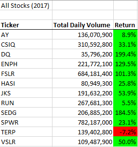
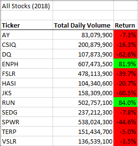
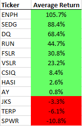
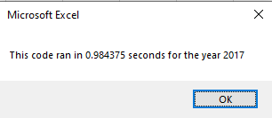
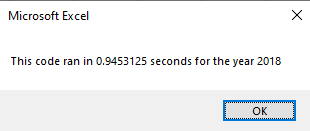
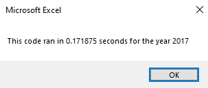
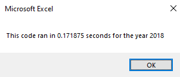
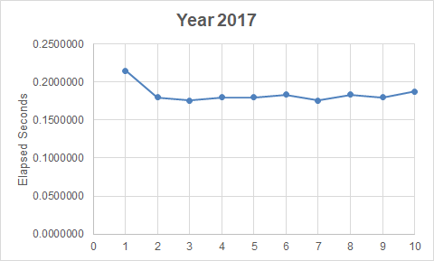

# VBA of Wall Street

## Overview of Project

### Purpose
The purpose of this analysis is to show my findings from the All Stocks Analysis and explain whether refactoring the code to loop through all the data one time successfully made the VBA script run faster.
## Results

### All Stocks Performance Analysis

The purpose of this code is to analyze an entire dataset of stocks prices and volumes at the click of a button. This code also provides the ability to specify the year for the analysis. Currently, Steve's parents are putting all their money in the DQ stock. With this code, Steve and parents would be able to compare DQ to other alternative energy stocks' performance in 2017 and 2018 at the press of a button and get some new investment ideas to expand their portfolio.

When clicking the "All Stocks Analysis" button, the code will run automatically by looping through the dataset once and calculating the total volume and year-end return for each ticker. In addition to providing these numbers, the code will automatically format the results so that it is easier for the reader to compare the performance of the stocks. The results of the All Stocks Analysis for the years 2017 and 2018 are illustrated in the tables below.

As shown in the image above, DQ had the strongest stock return performance among the set of stocks provided by Steve. However, the 2017 performance cannot be used as the determining factor for only buying DQ especially when we look at the stark contrast of 2018's performance as shown in the table below.

According to the graph, this set of stocks experienced a decline in returns of approximately 76% on average in 2018. Moreover, DQ experienced the greatest decline in return in 2018, thus, showing the high volatility of this stock. On the other hand, there were two stocks that stuck out to me because of their consistent positive returns across 2017 and 2018: ENPH and RUN. Also, when comparing ENPH and RUN to the average return of each stock in 2017-2018, ENPH and RUN have a higher average return than DQ as shown in the average return ranking table below. Above all, ENPH and RUN demonstrated resiliency in maintaining high positive returns despite the overall decline in returns in 2018. Therefore, my suggestion to Steve's parents would be to purchase at least ENPH and SEDG to include in their alternative energy stocks portfolio because of their stable average higher return and also because it will enable them to diversify their portfolio with stocks from companies that provide different alternative energy products.

### Refactoring of the Code Analysis
My friend Steve appreciated my help with creating this code that analyzes many stocks at the click of a button, but Steve also needed my help with making the code more flexible and efficient to analyze a wider set of stocks.  

In this analysis, I implemented a refactoring of the code to test whether refactoring could make the VBA script run faster. I created an index and three arrays, tickerVolumes, tickerStartingPrices, and tickerEndingPrices, in addition to the tickers array that was also included in the original code of the module. As the image below shows, the index was used as a reference across the different arrays used in the loop so that when the loop was running through the data, it would know where the set of data for a specific ticker is located by using the tickerIndex and because the data for each ticker is store in groups. Particularly, the If-Then statement helped the code identify where the set of data changed from one ticker to the next. Additionally, the tickerIndex increment was conducted within the If statement. As a result, the loop would go through the data one time and collect all of the information as it goes from one set of data for a specific ticker and then to the next, without having to go through the entire set of rows multiple times. 

In the original code from the module, there was no assumption that the data for each ticker was organized in groups. As shown in the image below, every time a new ticker is selected, the code will run through all the rows searching for this specific ticker and its corresponding data in order to not leave any data for a ticker behind. This is particularly shown by the If-Then statement above the totalVolume calculation which intructs the code to search through the entire set of rows to seek for the data for a specfic ticker before switching to the next ticker. Once the code finished reading all the rows searching for this ticker, it would then switch to the next ticker and read through the entire set of rows once again. As a result, the loop would be going through the same set of data **12 times** which causes a delay in execution. 

When running the original code without refactoring, the All Stocks Analysis takes about 0.98 and 0.95 seconds to run for the years 2017 and 2018 respectively.

Comparatively, after implementing refactoring to the original code, the All Stocks Analysis takes about 0.17 secs to run for both 2017 and 2018.

By understanding the structure of the data and using the tickerIndex to specify which ticker to look for, it helped reduced the runtime of the code by approximately an average of 0.79 secs or 82% for a database that contains 3013 rows of entries and which could have made an even greater difference for a bigger database.

### Analysis Results Challenges
A challenge encountered when comparing the execution times of refactored and non-refactored code was to ensure that the code running times were comparable. This was a challenge because the first time you run a macro, the elapsed time may be longer than subsequent runs since computer resources need to be allocated to run a macro in the first time. Therefore, it is important to ensure that the computer resources have been allocated by running the macros several times first and then compare the elapsed times. Once the difference between the elapsed times for the same macro is minimal, then it is safe to compare it to the elapsed times of other macro runs. For instance, when conducting 10 consequent runs of the refactored code for 2017 as shown in the line graph below, the biggest difference between the elapsed times lies between the first and second run. Therefore, it is important to not use the first run of the macro for elapsed times comparison purposes since the computer resources have not been allocated yet. 

## Summary

Refactoring code is a common practice since first versions of codes are not always the most efficient ones. A lot of people may agree that there are plenty of advantages from refactoring code, but there are also people who disagree with this approach. Although I understand that the impact of refactoring varies from project to project, I believe that the overall advantages outweigh the disadvantages:

### Advantages of Refactoring
* It can improve the efficiency of the code by shortening execution time
* It can eliminate redundant steps in the code and make it more simple
* It gives you the opportunity to make the code more flexible in order to be adaptable for future projects
* It allows for code that is cleaner and easier to read

### Disadvantages of Refactoring
* Depending on the circumstances and the changes to be made, rewriting the code from scratch could be more efficient than making some big changes
* Refactoring code can be time-consuming and expensive, especially for bigger projects
* If the refactoring is done incorrectly, it can make the system less effective
* Depending on the data structure, refactoring code might require some data cleaning or restructuring beforehand which is a time consuming activity  
 
In the code for the All Stocks Analysis, the benefits from refactoring outweighs the disadvantages. By recognizing the grouping structure of the stocks' data, refactoring the initial nested For Loop to a For Loop that uses indexing for the tickers helped the execution time reduce by about an average of 0.79 seconds or 82%. Through the refactoring of the initial code, I was able to reduce the redundant steps of reading all the rows multiple times to reading it only once and gather all the information needed. Additionally, the code became much simpler and easier to read as well as more adaptable for larger sets of data since the execution time has been greatly reduced. Most of the disadvantages mentioned above are not applicable in this case because of the relatively simple structure and high-level nature of the project. However, it is important to mention that the refactoring worked because of the structure of the data which is organized in groups. If the data for each ticker had come in a random order or organized in chronological order regardless of the grouping of tickers, this refactoring might have not worked or at least required some additional code to organize the data. Nevertheless, implementing refactoring to the original code made it more efficient and adaptable for larger data sets, which is what Steve is looking for.

